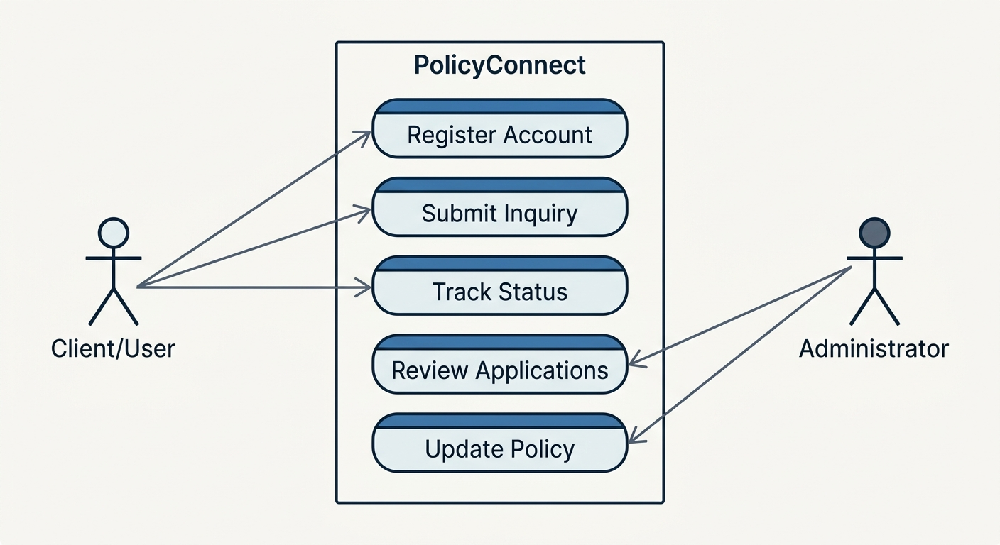
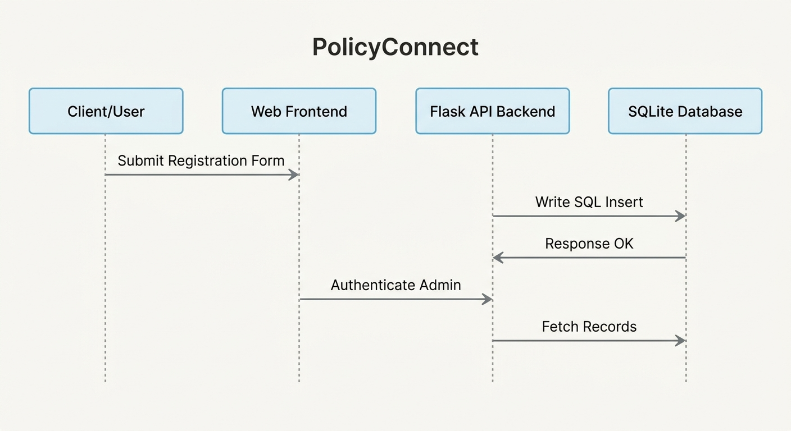

# System Documentation: PolicyConnect
## Insurance & Mutual Funds Enquiry Management System

This document provides a comprehensive technical overview, operational architecture, and detailed system requirements (hardware and software) for **PolicyConnect**, a robust college project built for insurance policies and mutual fund enquiry management, featuring client user registration, tracking dashboards, and an advanced administrative control desk.

---

## 1. Project Overview & Scope
**PolicyConnect** is a full-stack web application designed to bridge the gap between financial advice seekers and insurance agency administrators. It enables clients to register user accounts, login securely, submit multi-field enquiries (detailing demographic characteristics and address details), monitor evaluation statuses, and submit follow-up logs dynamically. Administrators can securely sign in to view rich visual tables of applicants, dive into high-fidelity detail portals, issue official Policy Numbers, write support responses, and transition status values through structured stages.

### Core Modules
1. **User Portal / Landing Page (`index.html`)**: Interactive intro highlighting service packages.
2. **Customer Enquiry Desk & Workspace (`enquiry.html`)**: Self-service workspace containing:
   - Secure Registration Form
   - Dedicated User Login panel
   - Custom Track & Status dashboard
   - Detailed form submission system (demographics, comment logs, current & permanent addresses)
   - Customer support response viewer & follow-up chat engine
3. **Administrative Command Center (`admin.html`)**: Rich control panel featuring:
   - Admin credential gate (protected database-level validation)
   - Process-flow grid depicting dates, status badges, applicant details, issued certificates
   - Rich interactive modal showing full customer files, multiple addresses, and full conversational logs
   - Live admin response text generator and policy issuer
4. **Knowledge Desk (`faqs.html`)**: Customer self-help workspace.

---

## 2. System Architecture & Flow
The application utilizes a lightweight, production-grade 3-Tier Architecture.

```
       +---------------------------------------------+
       |               PRESENTATION TIER             |
       |      HTML5, CSS3 (Tailwind CSS UI, Flexbox) |
       |          Vanilla ES6 Client-Side Script      |
       +----------------------|----------------------+
                              | HTTP REST Requests
                              v
       +---------------------------------------------+
       |                APPLICATION TIER             |
       |     Backend Server Handles REST Endpoints   |
       |     Dual-Portability: Python (Flask) / Node |
       +----------------------|----------------------+
                              | SQL / Memory writes
                              v
       +---------------------------------------------+
       |                 DATABASE TIER               |
       |        SQLite3 Relational DB (Production)   |
       |       JSON Offline Storage (Backup layer)  |
       +---------------------------------------------+
```

---

## 3. System Requirements

### A. Hardware Requirements
These specifications ensure stable development, execution, and local hosting of the PolicyConnect platform.

| Resource Element | Minimum Specification | Recommended Specification |
| :--- | :--- | :--- |
| **Processor (CPU)** | Intel Core i3 / AMD Ryzen 3 or equivalent (1.5 GHz Dual-Core) | Intel Core i5 / AMD Ryzen 5 or higher (2.4 GHz+ Quad-Core) |
| **System Memory (RAM)** | 4 GB DDR3 | 8 GB DDR4 / DDR5 or higher |
| **Storage Unit** | HDD with at least 500 MB available spacer | SSD (Solid State Drive) with 1 GB available spacer |
| **Network Interface** | Standard Wi-Fi / Ethernet adapter for local network hosting | Gigabit Ethernet / Dual-band 802.11ac client adapter |
| **Display Unit** | 1366 x 768 native resolution | 1920 x 1080 Full-HD native resolution for rich grids |

### B. Software Requirements
This project is engineered with Dual-Compatibility. It can be executed either using Python (Flask runner) or Node.js (Express runner). Choose the respective runtime ecosystem according to local computer configuration.

#### 1. Core Operating Systems
- **Windows**: Microsoft Windows 10 or Windows 11 (64-bit)
- **macOS**: Apple macOS Monterey (v12.0) or higher
- **Linux**: Ubuntu 20.04 LTS / Debian 11 or higher

#### 2. Runtime Environments & Libraries (Detailed with Versions)

##### Option A: Python Runtime Stack (Highly Recommended for SQLite Development)
- **Programming Language**: **Python 3.10.x / 3.11.x / 3.12.x**
- **Ecosystem Libraries & Packages**:
  - `Flask == 3.0.3` (Core micro-framework hosting REST API routing)
  - `Flask-Cors == 4.0.1` (Resolves cross-origin asset resource loading requests)
  - `sqlite3` (Built-in Python integration layer connecting the SQL base)

##### Option B: Node.js Runtime Stack (Alternative Server Runner)
- **Programming Language**: **Node.js v18.x LTS / v20.x LTS**
- **Ecosystem Libraries & Packages** (`package.json`):
  - `express == ^4.21.2` (Minimalist web framework)
  - `cors == ^2.8.6` (CORS middleware)
  - `sqlite3 == ^6.0.1` (Asynchronous SQLite database driver bindings)

#### 3. Client Web Web-Browsers
To correctly render the UI patterns, the client must use a contemporary browser with full ECMAScript 6, CSS Variables, and Flexbox capabilities:
- **Google Chrome**: Version 120+
- **Mozilla Firefox**: Version 120+
- **Apple Safari**: Version 16+
- **Microsoft Edge**: Version 120+

#### 4. Development Tooling & IDEs
- **Code Editor**: Visual Studio Code (v1.85+), Cursor, or Sublime Text 4.
- **Terminal Emulator**: PowerShell 5.1+, macOS Terminal, Git Bash, or Linux Command Prompt.

---

## 4. File Structure Directory Layout
Below is the clean outline of the project workspace directory structure:

```
policy-connect/
├── public/                 # HTML UI pages and styling engines
│   ├── index.html          # PolicyConnect Home Landing Page
│   ├── enquiry.html        # Client registration page, customer dashboard, and follow-up console
│   ├── admin.html          # Policy evaluator desk, details modal, and search matrices
│   └── faqs.html           # Information portal
├── app.py                  # Primary python entrypoint handling database and API routing
├── server.js               # Secondary Node.js runner with Express integration
├── requirements.txt        # Configured python modules checklist
├── package.json            # Node.js project description configuration
├── database.db             # Dynamically created SQLite3 database file
├── persistent_database.json# Internal JSON database fallback cache
└── DOCUMENTATION.md        # Technical System Specification file (This File)
```

---

## 5. Main Database Schema Design
The **SQLite3** relational base (`database.db`) consists of three essential relational entities:

### `users` (Client Registrations)
Tracks individuals registered on the network.
- `id` (INTEGER PRIMARY KEY AUTOINCREMENT): Unique identifier.
- `fullName` (TEXT): Core display name.
- `phone` (TEXT UNIQUE): Primary search identifier.
- `email` (TEXT UNIQUE): Valid email mapping.
- `password` (TEXT): Encrypted/Safe raw password string.

### `enquiries` (Service Tickets)
Stores structural ticket metadata, address coordinates, and tracking statuses.
- `id` (INTEGER PRIMARY KEY AUTOINCREMENT): Unique ticket identifier.
- `fullName` (TEXT): Extracted applicant name.
- `phone` (TEXT): Extracted contact phone.
- `email` (TEXT): Extracted contact email.
- `age` (TEXT): Age metric.
- `gender` (TEXT): Gender categorical.
- `address` (TEXT): Text-based Permanent Address.
- `currentAddress` (TEXT): Custom current residence coordinate.
- `comments` (TEXT): Active customer comment conversation thread log.
- `status` (TEXT): Current ticket stage (`Pending`, `Processing`, `Accepted`, `Rejected`).
- `adminComments` (TEXT): Professional reviewer response remarks.
- `policyNumber` (TEXT): Assigned official insurance policy code (or `-` if none).
- `date` (TEXT): Timestamp of logging.

### `admins` (Secure Evaluators)
- `username` (TEXT PRIMARY KEY): Login name. (Default: `admin`)
- `password` (TEXT): Security value. (Default: `admin123`)

---

## 6. Core REST API Reference Endpoints

| Endpoint Route | HTTP Method | Target Request Body | Purpose |
| :--- | :--- | :--- | :--- |
| `/api/user/register` | `POST` | `{ fullName, phone, email, password }` | Registers a new applicant on the database. |
| `/api/user/login` | `POST` | `{ identifier, password }` | Authenticates User (accepts email or phone). |
| `/api/user/enquiries` | `GET` | *Query Params*: `?email=...&phone=...` | Pulls custom history of an individual user. |
| `/api/enquiry/comment` | `POST` | `{ id, userComment }` | appends date-stamped comments on user card. |
| `/api/enquiries` | `GET` | *None* | Pulls total records list (Admin only). |
| `/api/enquiries` | `POST` | `{ fullName, phone, email, age, gender, address, currentAddress, comments }` | Submits a new Enquiry form ticket. |
| `/api/enquiries/update`| `POST` | `{ id, status, policyNumber, adminComments }` | Overwrites status, policies & admin response logs. |
| `/api/admin/login` | `POST` | `{ username, password }` | Authenticates System Administrator. |

---

## 7. System Diagrams & Interaction Models
To conceptualize how transactions flow through the frontend clients, backend routing controllers, and relational storage tables, the following design assets have been defined:

*   **Use Case Diagram**: Highlights actor scopes, client tracking workflows, and administrative process tasks.
*   **Sequence Diagram**: Represents the step-by-step transaction timeline from user authentication to database updates, support log additions, and live tracking checks.

Detailed visual assets and complete **Mermaid.js code representations** for both models can be found in the accompanying [DIAGRAM.md](./diagram.md) file. Below are the visual flow outlines:

### Use Case Model Structure


### Chronological Sequence Model


---

## 8. Execution & Operation Steps

Please follow these operating steps to set up and run the code locally:

### 1. Extract Workspace Package
1. On your machine, download and extract the ZIP file containing this codebase.
2. Enter the workspace directory using Command Prompt or terminal.

### 2. Virtual Env Installation & Package Setup

#### Option A (Python Flask)
```bash
# Verify Python version
python --version

# Install dependencies defined in requirements.txt
pip install -r requirements.txt

# Launch persistent microserver
python app.py
```

#### Option B (Node.js Express)
```bash
# Verify Node version
node -v

# Install dependencies defined in package.json
npm install

# Run backend cluster
npm start
```

### 3. Application Verification
Once execution has succeeded, open your desired web browser and navigate to:
- Client Base Webpage: `http://localhost:3000/`
- Client Login & Enquiry Area: `http://localhost:3000/enquiry.html`
- Support / Administrator Control Portal: `http://localhost:3000/admin.html`
