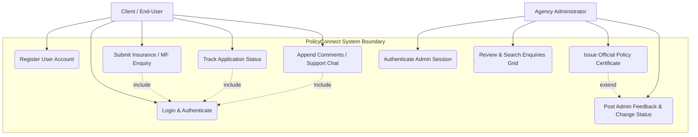
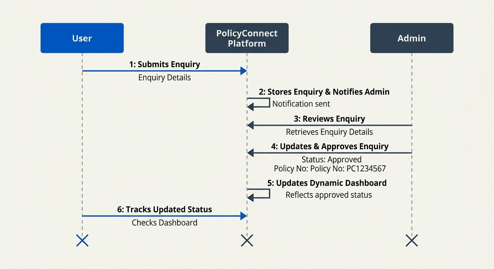
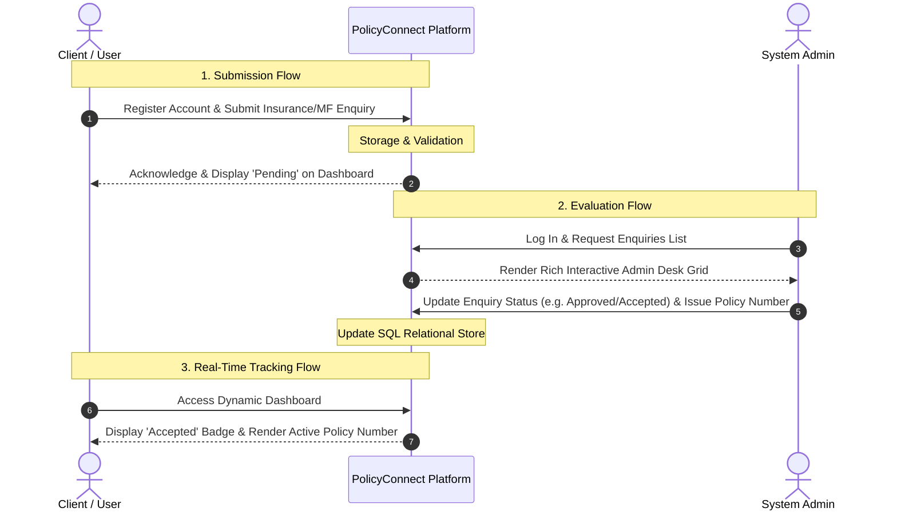

# System Diagrams & Architecture Specifications

This document contains the structural system behavior, interaction specifications, and transaction flows for **PolicyConnect** using both modern, scalable **Mermaid.js code representations** and **high-fidelity graphic architectural diagrams**.

---

## 1. Use Case Diagram

The Use Case diagram describes how different actors (users) interact with the functional boundaries of the PolicyConnect platform.

### A. Graphical Diagram representation
Below is the high-fidelity graphical Use Case Diagram illustrating the system boundaries and actor associations:

### B. Mermaid.js Code Syntax
For rendering directly in Git tools, Wikis, or diagram engines, use the following interactive Mermaid representation:

### C. Use Case Explanation
The interaction model highlights two primary roles with distinct business responsibilities:

1.  **Client / End-User Actor**:
    *   **Register User Account**: Safely submits customer name, phone, email, and password to establish a local security identity.
    *   **Login & Authenticate**: Signs in using verified phone number/email to spawn a persistent session.
    *   **Submit Insurance / MF Enquiry**: Inputs personal data (age, gender, address, and current residence) along with policy comments.
    *   **Track Application Status**: Inspects a tailored grid illustrating active ticket flows.
    *   **Append Comments / Support Chat**: Sends follow-up remarks to address administrative feedback.
2.  **Agency Administrator Actor**:
    *   **Authenticate Admin Session**: Overpasses the credential gate using database records (e.g., `admin` / `admin123`).
    *   **Review & Search Enquiries Grid**: Interacts with visual tables, filtering submissions by search criteria.
    *   **Post Admin Feedback & Change Status**: Modifies status badges (*Pending*, *Processing*, *Accepted*, *Rejected*) and files textual commentaries.
    *   **Issue Official Policy Certificate**: Generates official registration policy strings (`POL-XXXXX`) which are rendered live to the client.

---

## 2. Sequence Diagram (User's Interactive Flow)

The Sequence Diagram illustrates the high-level operational sequence and direct flow of events between the **Client/User**, the centralized **PolicyConnect Platform**, and the visual **System Administrator**.

### A. Graphical Diagram representation
Below is the high-fidelity graphical Sequence Diagram showing the direct User -> PolicyConnect -> Admin transaction flows:

### B. Mermaid.js Code Syntax
Use the following structured 3-tier Sequence Diagram representation representing the interactions:

### C. Sequence Diagram Explanation
This User -> PolicyConnect -> Admin interactive flow is structured into three main continuous execution phases:

1.  **Enquiry Registration and Submission (Steps 1–2)**:
    The end-user inputs demographic descriptors and address coordinates, which are securely post-saved on the PolicyConnect platform in a state initialized to **Pending**.
2.  **Administrative Audit and Decisive Verdict (Steps 3–5)**:
    The Administrator verifies credentials, accesses the complete applications grid, loads specific applicant cards inside interactive detail overlays, and modifies records. They transition statuses and bind a custom, certified policy code (e.g., `POL-XXXXX`).
3.  **Real-Time Status Tracking (Step 6)**:
    When the client refreshes or mounts their dashboard, PolicyConnect serves the updated entry. The user views the transition of status badges instantly, alongside their issued policy credentials.
